# 🎧 Nex Music (Cross-Platform Music Streaming App)

<table>
  <tr>
    <td align="center" style="padding: 20px;">
      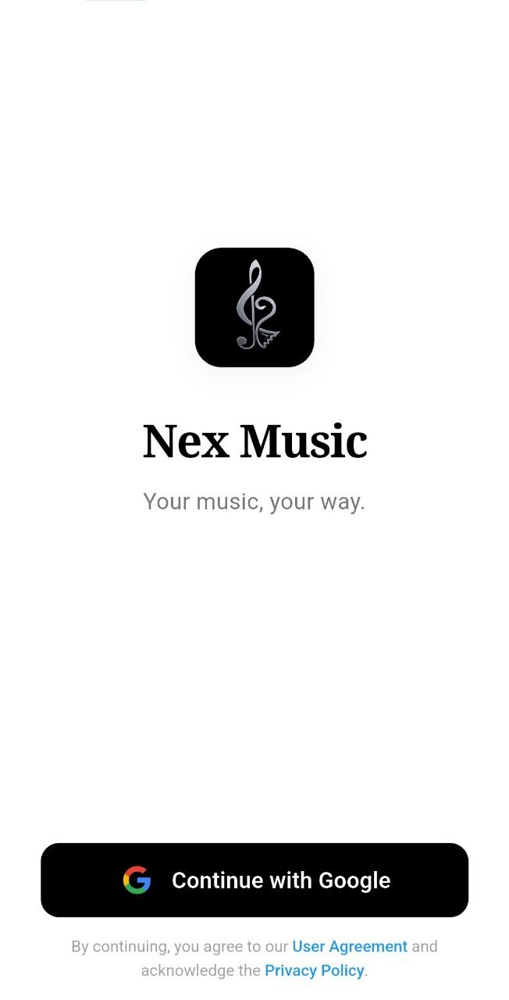
    </td>
    <td align="center" style="padding: 20px;">
      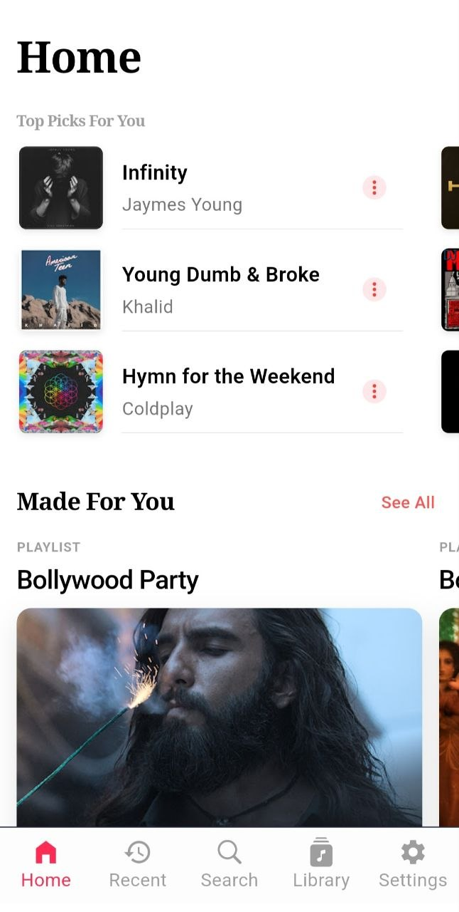
    </td>
  </tr>
  <tr>
    <td align="center" style="padding: 20px;">
      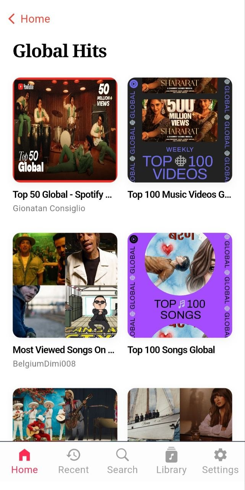
    </td>
    <td align="center" style="padding: 20px;">
      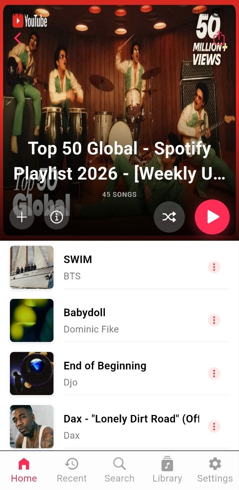
    </td>
  </tr>
  <tr>
    <td align="center" style="padding: 20px;">
      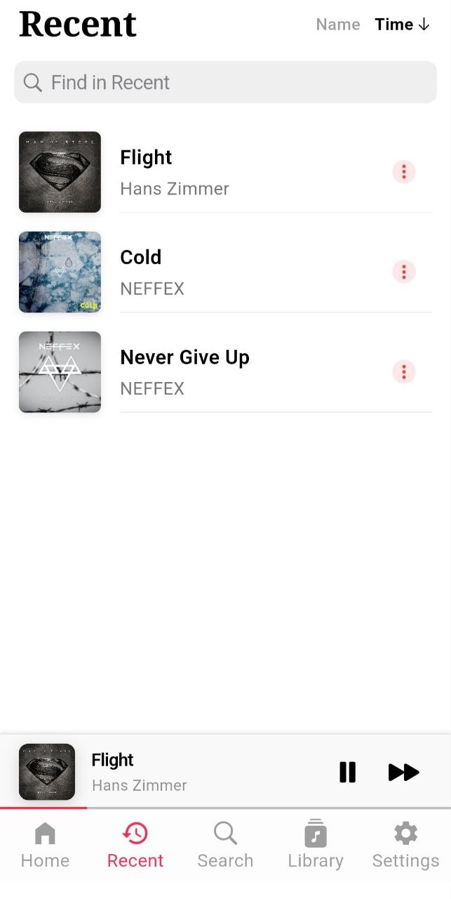
    </td>
    <td align="center" style="padding: 20px;">
      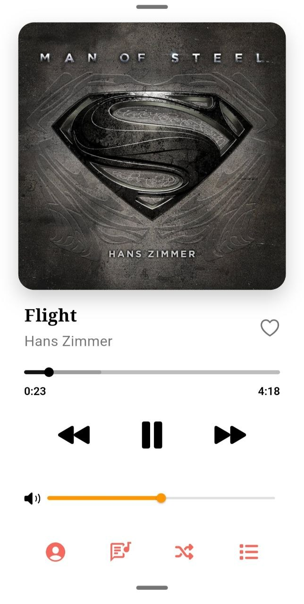
    </td>
  </tr>
  <tr>
    <td align="center" style="padding: 20px;">
      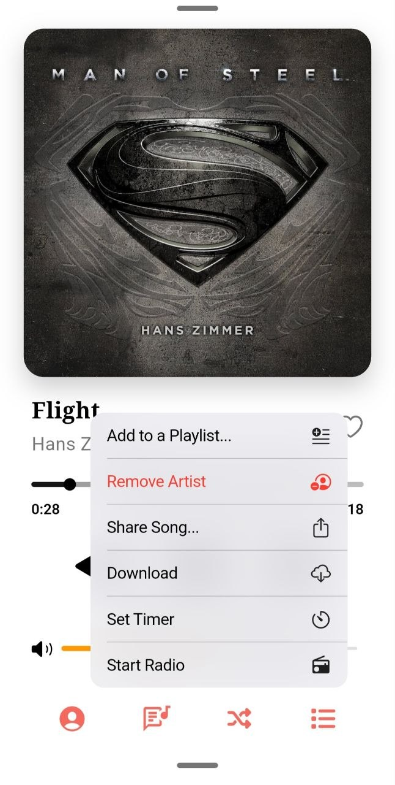
    </td>
    <td align="center" style="padding: 20px;">
      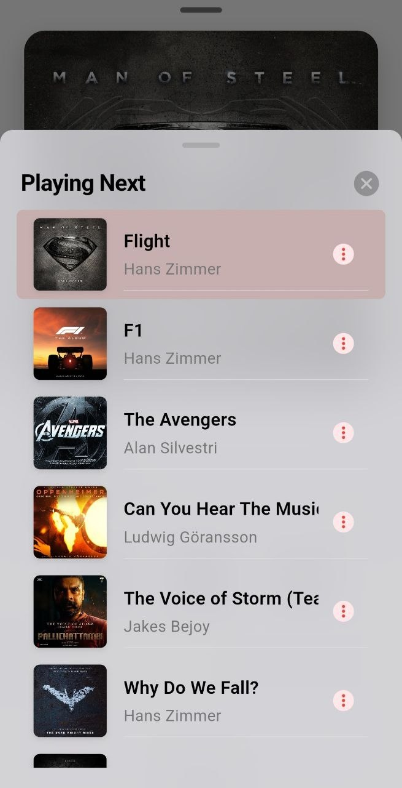
    </td>
  </tr>
  <tr>
    <td align="center" style="padding: 20px;">
      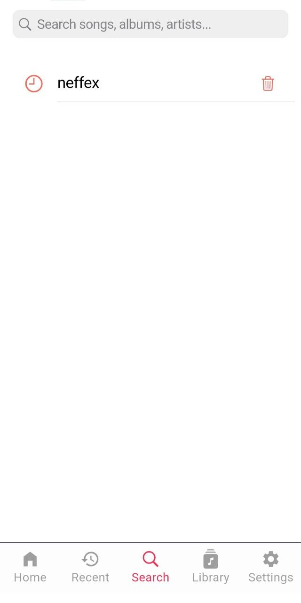
    </td>
    <td align="center" style="padding: 20px;">
      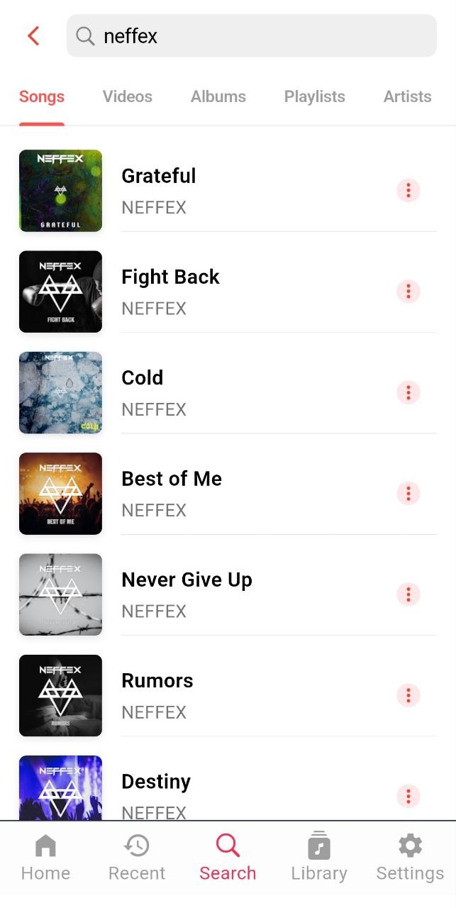
    </td>
  </tr>
  <tr>
    <td align="center" style="padding: 20px;">
      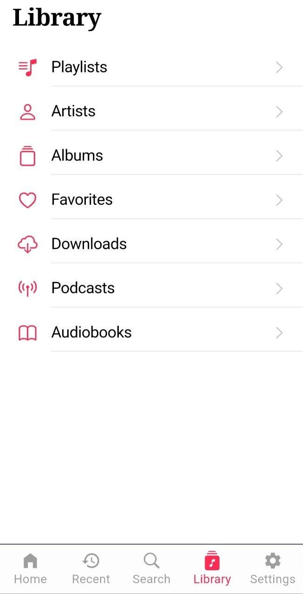
    </td>
    <td align="center" style="padding: 20px;">
      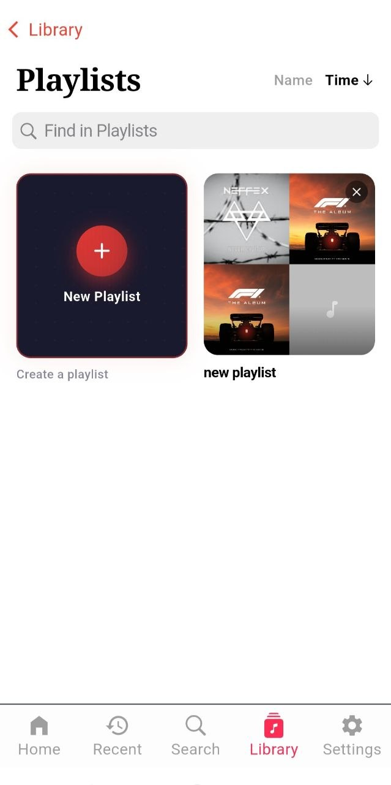
    </td>
  </tr>
  <tr>
    <td align="center" style="padding: 20px;">
      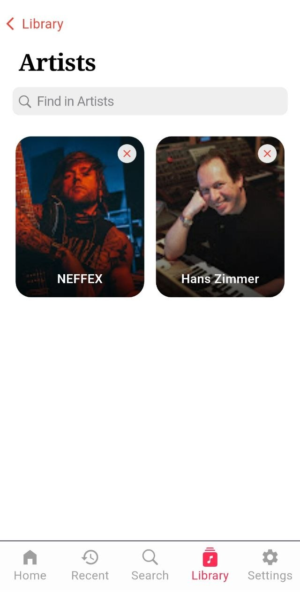
    </td>
    <td align="center" style="padding: 20px;">
      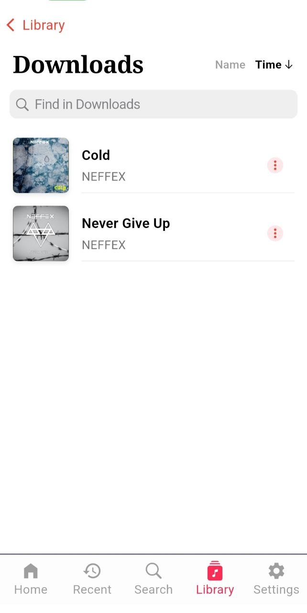
    </td>
  </tr>
  <tr>
    <td align="center" style="padding: 20px;">
      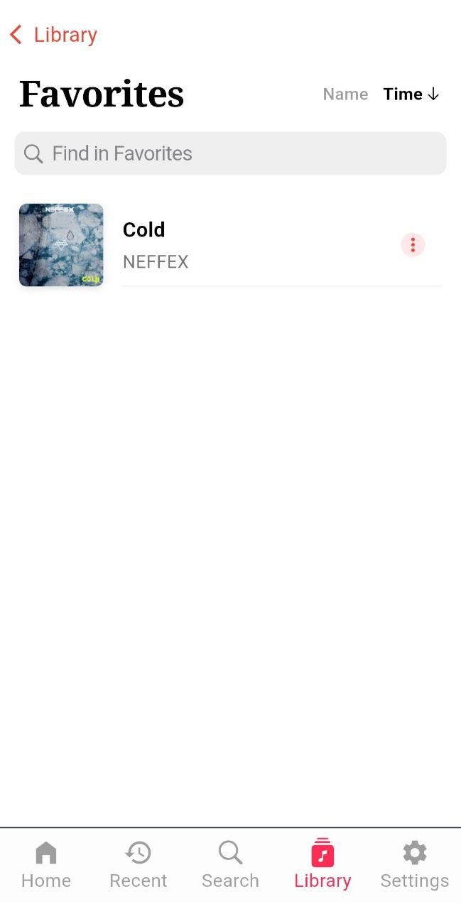
    </td>
    <td align="center" style="padding: 20px;">
      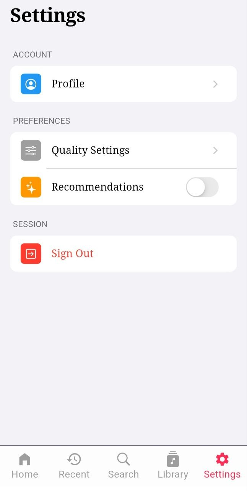
    </td>
  </tr>
  <tr>
    <td align="center" style="padding: 20px;">
      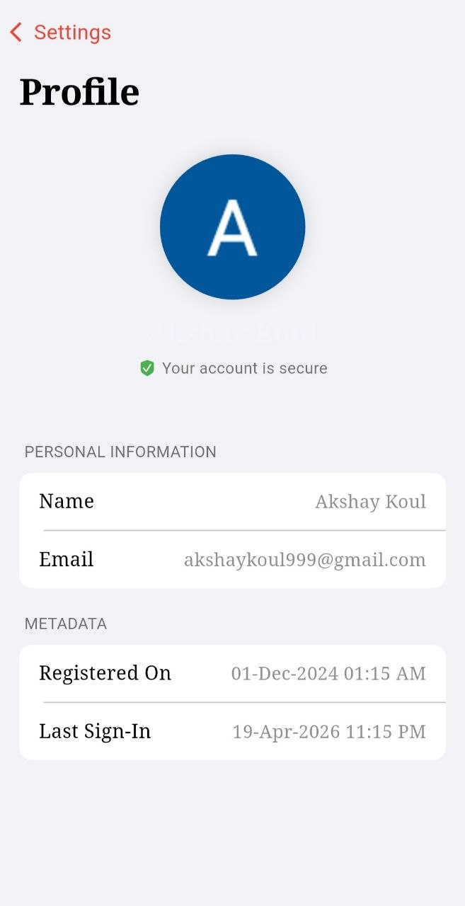
    </td>
    <td align="center" style="padding: 20px;">
      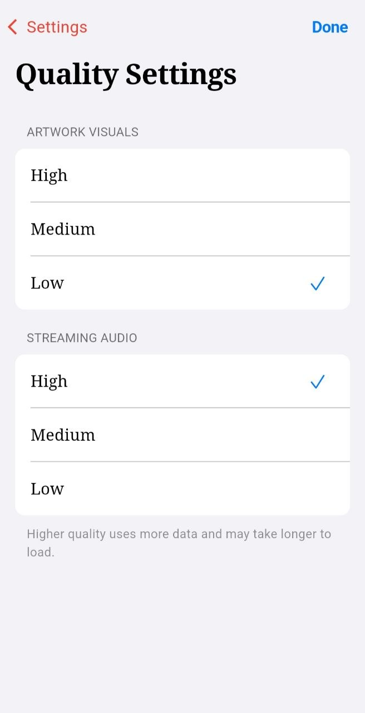
    </td>
  </tr>
</table>

---

## 🚀 Overview

**Nex Music** is a sleek, ad-free, and cross-platform music streaming app built with **Flutter**, allowing users to stream from YouTube/YouTube Music, create playlists, and sync data across devices with ease.

---

## 🎵 Features

- 🔴 **YouTube Playback** – Stream songs directly from YouTube or YouTube Music.
- 💾 **Song Caching** – Cache songs while playing for offline-friendly playback.
- 📥 **Offline Downloads** – Download songs and access them anytime, even without an internet connection.
- 🎧 **Background Music Support** – Continue listening even when minimized or in the background.
- 📝 **Create & Manage Playlists** – Personalized music library at your fingertips.
- ⚙️ **Streaming Quality Control** – Fine-tune stream and artwork quality based on your preferences and network.
- 🔐 **Google OAuth Login** – Secure authentication and real-time sync across devices.
- ❌ **No Ads** – 100% uninterrupted music experience.

---

## 🛠 Tech Stack

| Layer | Technology |
|-------|------------|
| **Frontend** | Flutter |
| **State Management** | BLoC |
| **Architecture** | BLoC Pattern |
| **Backend & Sync** | Firebase (Authentication, Firestore, Real-time Sync) |

---

## 📱 Platforms

- ✅ Android  
- ✅ Windows (Under Development)  
- ❌ iOS (Coming Soon)  
- ❌ macOS (Coming Soon)

---

## 🚧 Project Status

🛠 **Currently in active development.**  
Expect regular updates, new features, and improvements over time!

---
