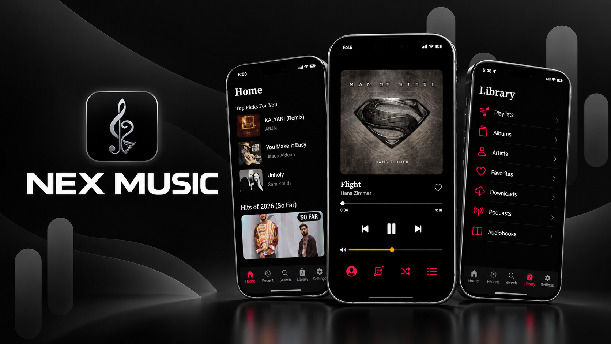

# 🎧 Nex Music (Music Streaming App)

<p align="center">
  
</p>

---

## 🚀 Overview

**Nex Music** is a sleek, ad-free music streaming app built with **Flutter**, allowing users to stream from YouTube/YouTube Music, create playlists, and sync data across devices with ease.

---

## 🎵 Features

- 🔴 **YouTube & YouTube Music Playback**  
  Stream your favorite songs directly from YouTube and YouTube Music.

- 💾 **Smart Song Caching**  
  Automatically cache songs during playback for faster loading and reduced data usage.

- 📥 **Offline Downloads**  
  Download songs and listen anytime, even without an internet connection.

- 🎧 **Background Playback**  
  Continue listening while using other apps or when your device is locked.

- 📝 **Playlists & Library Management**  
  Create, organize, and manage custom playlists with ease.

- 🎨 **Dark & Light Themes**  
  Switch between beautiful dark and light modes based on your preference.

- 📻 **Radio Mode**  
  Discover new music with endless radio stations generated from your favorite songs, artists, and genres.

- ⏭️ **Smart Up Next Queue**  
  Automatically loads and queues similar songs based on the currently playing track for uninterrupted listening.

- 🤖 **Personalized Recommendations**  
  Get music suggestions tailored to your listening habits.

- ⚙️ **Streaming Quality Control**  
  Adjust audio and artwork quality to match your network conditions and preferences.

- 🔍 **Powerful Search**  
  Instantly find songs, albums, artists, playlists, and videos.

- ❤️ **Favorites & Liked Songs**  
  Save your favorite tracks and access them anytime.

- 🔄 **Cloud Sync**  
  Sync playlists, favorites, downloads, and listening history across devices.

- 📜 **Listening History**  
  Easily revisit recently played songs.

- 🎵 **Queue Management**  
  Add, remove, reorder, and manage your playback queue effortlessly.

- 🌐 **Online & Offline Library**  
  Access both streamed and downloaded music from a unified library.

- 🔐 **Google OAuth Authentication**  
  Secure login with Google and seamless account synchronization.

- 🚫 **Ad-Free Experience**  
  Enjoy your music without interruptions, ads, or distractions.

---

## 🛠 Tech Stack

| Layer | Technology |
|-------|------------|
| **Frontend** | Flutter |
| **State Management** | BLoC |
| **Backend & Sync** | Firebase (Authentication, Firestore, Real-time Sync) |

---

## 📱 Platforms

- ✅ Android  
- ✅ Windows (Under Development)  
- ❌ iOS (Coming Soon)  
- ❌ macOS (Coming Soon)

---

## 🚧 Project Status

🛠 **Currently in active development.**  
Expect regular updates, new features, and improvements over time!

---

## 📜 License
```
Nex Music is free software licensed under GPL v3.0 with the following conditions:

- Copied/Modified versions of this software cannot be used for 'non-free' and profit purposes.
- You cannot publish copied/modified versions of this app on closed-source app repositories
  like PlayStore/AppStore.
```
---

## ⚠️ Disclaimer
```
This project has been created while learning, and learning is the main intention.
This project is not sponsored by, affiliated with, funded by, authorized by, or endorsed by any content provider.
Any song, content, or trademark used in this app is the intellectual property of its respective owners.
Nex Music is not responsible for any infringement of copyright or other intellectual property rights that may result
from the use of the songs and other content available through this app.

This software is released "as-is", without any warranty, responsibility or liability.
In no event shall the Author of this Software be liable for any special, consequential,
incidental or indirect damages whatsoever (including, without limitation, any
other pecuniary loss) arising out of the use of or inability to use this product, even if
the Author of this Software is aware of the possibility of such damages and known defect.
```
